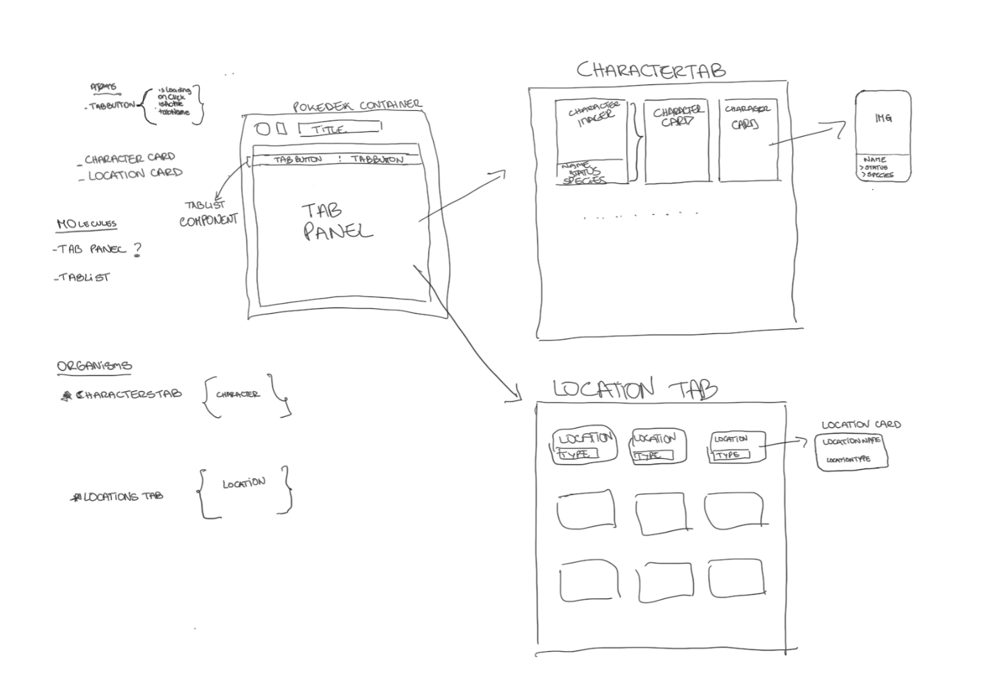
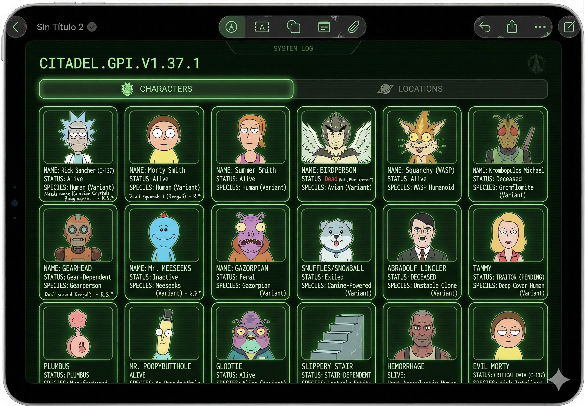
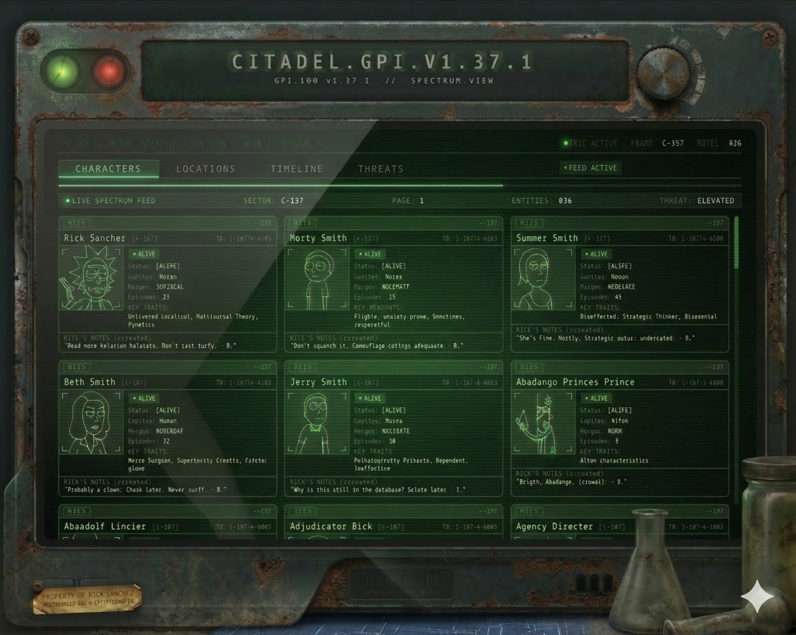

# Rick-Morty-Challenge

Practical Exercise – Dashboard Tabs with React Query

🧩 Goal

Build a small Next.js page that contains:

- 2 tabs
  - Characters
  - Locations
- Each tab fetches data from the Rick & Morty API
  https://rickandmortyapi.com/documentation
- Display a simple styled card per item (no pagination required)
- Avoid unnecessary refetching when switching tabs

This exercise is meant to simulate a small feature inside a dashboard-style application.

⸻

⚙️ Technical Stack

Please use:

- Next.js (pages router)
- TypeScript
- styled-components
- Axios
- @tanstack/react-query (v5)

⸻

📄 Functional Requirements

1. Tabs
   - Two tabs: Characters and Locations
   - Switching tabs should:
     - Not reload the page
     - Not refetch data if it was already loaded

Keep the UI simple — we are not evaluating design skills.

⸻

3. Characters Tab

Fetch from:

```
GET https://rickandmortyapi.com/api/character
```

Display a simple card per character showing:

- Image
- Name
- Status
- Species

⸻

3. Locations Tab

Fetch from:

```
GET https://rickandmortyapi.com/api/location
```

Display a simple card per location showing:

- Name
- Type

⸻

🎨 Styling

- Use styled-components
- Keep styles simple
- No need for responsiveness, animations, or advanced layout

⸻

🧠 What We’re Evaluating

This is not about perfection or pixel accuracy. We would like to understand your thinking and how you work.

You don’t need to overengineer the solution.

Keep it clean, readable, and maintainable.

⸻

🚫 What Is Not Required

- No pagination
- No filtering
- No authentication

⸻

📦 Deliverables

Please provide: 1. A Git repository (public or shared access) 2. A short section in this README explaining: 3. Any tradeoffs you made 4. What you would improve if this were production code

⸻

🤖 AI Usage Disclosure

You are allowed to use AI tools.

If you used any AI tool during development, please specify in this README:

- Which tool you used (e.g., ChatGPT, Copilot, etc.)
- For what purpose (e.g., scaffolding, debugging, typing interfaces, etc.)
- Why you chose to use it

We are not judging AI usage negatively.
We want transparency and to understand how you integrate tools into your workflow.

⸻

⏱ Time Expectation

Please don’t spend excessive time polishing details.
We are more interested in how you approach the problem than in a perfect final result.

⸻

💬 Notes

If any requirement is unclear, make reasonable assumptions and document them in this README.

Clarity of thinking is more important than completeness.

⸻

# Pedro Copes Personal notes

## Introduction

When i read the challenge i knew i wanted to create a pokedex like design since it goes very well with showing characters and stats, and well in this case locations. of course this is a super simple design of one but i tried giving it a device look to it.

## Techonological Approach & Decisions Taken

All the requested technologies were used for this challenge of course but lets make a little more in depth overview on the development process. I started by drawing a mock on my tablet, that ill attach next, so that i could have a first outline of the building blocks that i would need for the project. I knew i wanted to follow the atomic design methodology so i could keep a clean structure



Once i had my initial draft i new what my basic components would be:

* first i would need some ui components for my device and my device screen, but these would be just styled components
* then inside my screen i would have:

  * a tablist component, a molecule that holds the two buttons for the tabs, these beings instances of the TabButton component themselves
  * the tab panel implemented by each individual tab component so CharactersTab component and LocationsTab component that get rendered conditionally based on the value of the selected tab

I wanted to include semantic tags for the tab controls so at one point i had defined a TabPanel component that held all said aria functionality and both LocationsTab component and CharactersTab component rendered but it was too little code for this challenge, if it were to scale up and more features were needed it could be reimplemented.

When it comes to data fetching and managing it was requested to not refetch it data was already loaded, so tanstack's query comes in really handy for this with its configuration options. Since the api routes to connect to where characters and locations i created a service for each route, each one a custom useQueryHook configured with the staleTime property set to 'Infinity' so that the data fetched would always is considered fresh and therefore never refetched unless manually triggered but that was not the case in the application. The query functions used axios for data fetching and error handling as requested for which i created an Axios Instance that would encapsulate the base url  and created a util error handler.

For the styling i created a theme with the variables that i neeeded, and though initially i had grabbed some stuff from one of my other repo's i immediatly scratched it decided to it build it as i developed the app. I then fed my initial layout to Gemini and  Claude asked both to give me a UX UI designer take on the layout and take that into a pokedex design with rick and morty vibes and after a few tweeks to my promp they both gave me some good alternatives that i could use as inspiration or starter point to create a simple but  styled interface. here are the designs the AI created and that i refactored into my application:





As it can be seen there are some pretty cool styles (specially the second edit) that would be hard and time consuming to implement for this project but i took some ideas, i liked the font so i consulted what it was and what other similar fonts i could use, i also liked the idea of a the green screen so i wanted to take that for my styles as well as the dot indicator for their life status and i also asked the ai for styling rules on how to produce lines on the screen that i have simulating screen static. Since im covering ai usage, i checked with ai was how to import the local font because i didnt remember how to do so. One other important thing that i consulted was the boilerplate code to fix FOUC on _document.tsx in order to get the app to receive the styles provided by my ThemeProvider from the start by having them collected on the server's side.

## Possible Enhancements

Next i would go over some possible changes i would introduce if it were a bigger project.

* Incorporate unit testing
* Introduce app wide state management
* Change the imports of the tab components to dynamic import if the tabs amount were to scale up.
* Refactor services custom hooks if application were to need pagination to manage query key based page handling, store previous data and prefetch next page data for better user experience

## Footnote

* I noticed that my project structure was incorrect so when cloning the project one would have to inconveniently move over to the inside directory to boot up the project so i decided to made an extra commit to move the files out of that unnecesary folder, even though it would result in a big commit.
* Updated the original readme file's typo on the api definition for characters ( originally referenced location on the title and url)
